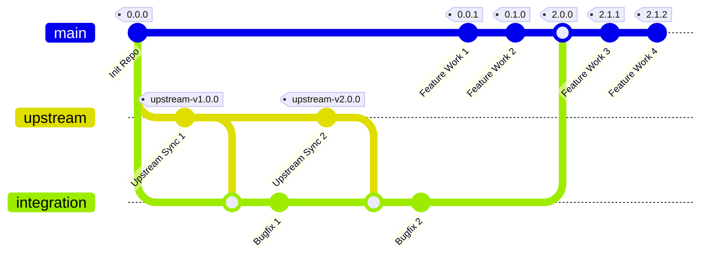

# Fork Management Template

This repository provides an automated template for managing long-lived forks of upstream repositories, ensuring controlled synchronization and release management. For detailed design and requirements, see the [Product Requirements Document](doc/prd.md).

## Features

This template automates the process of maintaining a fork while keeping it updated with upstream changes. When you create a repository from this template, it will:

- Set up a structured branch strategy for controlled upstream synchronization
- Configure automated workflows to handle syncing, validation, and releases
- Enforce branch protection rules to maintain repository integrity
- Manage releases with semantic versioning and upstream tracking

## Prerequisites

Before starting, ensure you have:
- GitHub account with repository creation permissions
- Personal Access Token (PAT) with required permissions:
  - `repo` (Full control of private repositories)
  - `workflow` (Update GitHub Action workflows)
  - `admin:repo_hook` (Full control of repository hooks)

## Quick Start

### 1. Create New Repository
1. Click the "Use this template" button above
2. Choose a name and owner for your new repository
3. Create repository

### 2. Initialize Repository
1. Go to Actions → Select "Initialize Fork" → Click "Run workflow" (if not already running)
2. An initialization issue will appear in the Issues tab
3. Follow the instructions in the issue from the bot to complete setup

## Branch Structure

The permanent branches control how upstream updates flow through validation before reaching the main branch:

```
             ┌────────────────────────┐
             │ fork_upstream          │
             │ (Tracks Upstream)      │
             └────────────────────────┘
                      ↓
             ┌───────────────────────┐
             │ fork_integration      │
             │ (Conflict Resolution) │
             └───────────────────────┘
                      ↓
             ┌───────────────────────┐
             │ main                  │
             │ (Stable)              │
             └───────────────────────┘
              ↑                     ↑
        Feature Branches       Certified Tags
        (Feature1, etc.)      (Downstream Pull)
```

## Automated Workflows

These workflows keep your fork in sync, enforce validation rules, and manage releases automatically:

### 1. Upstream Sync
- Scheduled automatic sync from upstream repository
- Manual sync available via Actions tab
- Automated conflict detection and notification
- [Details →](doc/sync-workflow.md)

### 2. Validation
- Enforces commit format and branch status
- Prevents merging of invalid PRs
- Ensures code quality and consistency
- [Details →](doc/validation-workflow.md)

### 3. Release Management
- Automated versioning and changelogs
- Tracks upstream versions with release tags
- [Details →](doc/release-workflow.md)

## Development Workflow



### 1. Feature Development
1. Branch from main: `git checkout -b feature/my-feature main`
2. Make changes and test
3. Use conventional commits:
   ```
   feat: new feature
   fix: bug fix
   feat!: breaking change
   ```
4. Create PR → Review → Merge

### 2. Upstream Sync Process
1. Auto-sync PR created daily
2. Review changes
3. Resolve conflicts if needed
4. Merge sync PR

### 3. Release Process
1. Merge to main with conventional commits
2. Release Please handles versioning and changelog
3. Release includes upstream version tracking
