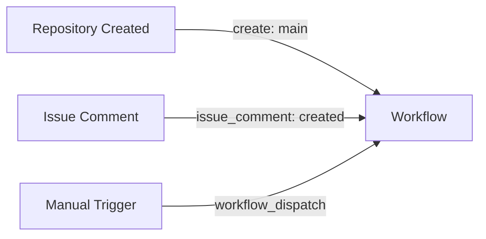
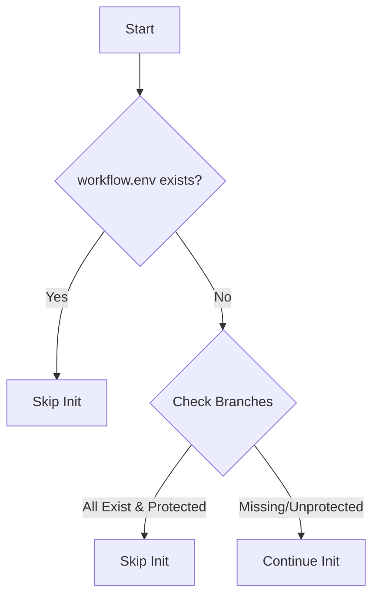
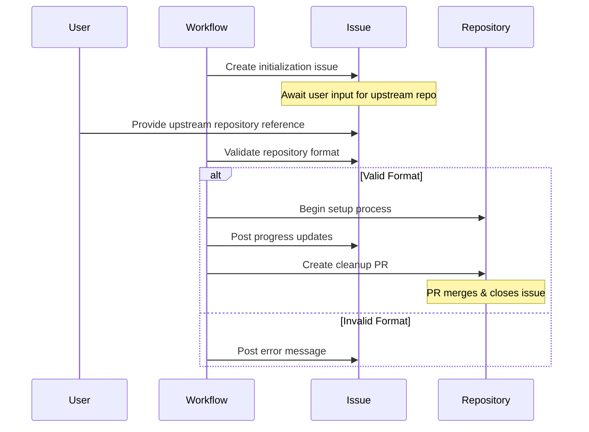
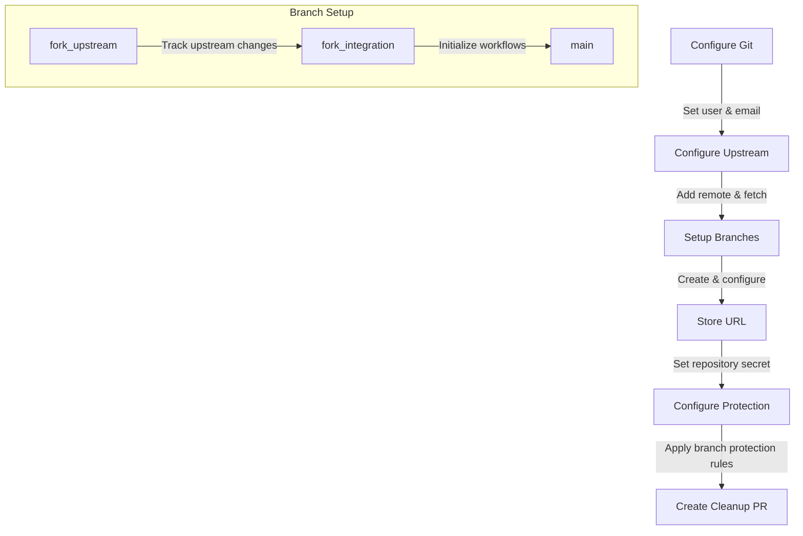
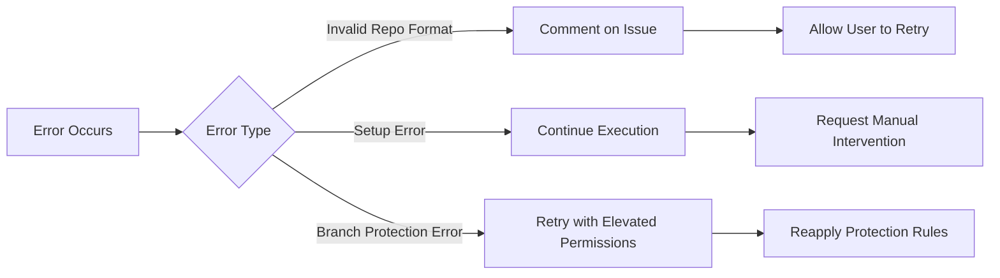
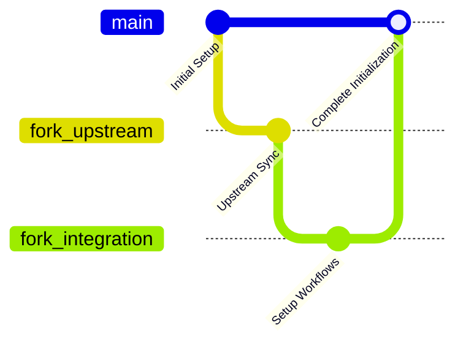

# Fork Management Initialization Workflow

The Initialization Workflow (`.github/workflows/init.yml`) automates the setup of a fork management repository, ensuring proper branch structures, protection rules, and configurations are applied. This workflow streamlines the process of bringing online a fork with its upstream repository while maintaining controlled updates and synchronization.

## Purpose

The goal of this workflow is to:

- Establish the required branch structure for proper upstream synchronization.

- Configure branch protection rules to maintain repository integrity.

- Manage repository setup through automated issue tracking.

- Provide a clean initialization process by handling setup, validation, and cleanup efficiently.

## How the Workflow is Triggered

The workflow can be triggered through multiple mechanisms:

### Trigger Details

1. Automatic – Runs when a repository is created with the main branch.

2. Issue Comment – Activated when a user provides an upstream repository reference in an issue.

3. Manual – A repository owner can trigger it from GitHub Actions.

## Initialization Process

### 1. Workflow Startup & Validation

The workflow first checks if initialization is necessary by determining:

- If .github/workflow.env exists (indicating prior initialization).

- If required branches (main, fork_upstream, fork_integration) are already present and protected.

### 2. Issue-Based Setup

If initialization is required, the workflow creates an issue and awaits the user to provide the upstream repository reference.

### 3. Repository Configuration

Once a valid upstream repository is provided, the following setup process begins:

### 4. Branch Protection Rules

The workflow enforces branch protection policies on main, fork_upstream, and fork_integration:

- Requires status checks (validation workflow must pass before merging).

- Enforces linear commit history (no forced push or branch deletions).

- Enables conversation resolution for PR discussions.

### 5. Cleanup Process

Once the repository is initialized, the workflow automatically generates a cleanup PR to remove unnecessary initialization files:

- Deletes ISSUE_TEMPLATE/ directory.

- Removes PULL_REQUEST_TEMPLATE/init-pr.md.

- Deletes .github/workflows/init.yml.

- Cleans up editor-specific files.

The cleanup PR closes the initialization issue upon merging.

## Error Handling & Troubleshooting

The workflow includes robust error-handling mechanisms to ensure a smooth setup process.

## Final Repository Structure

