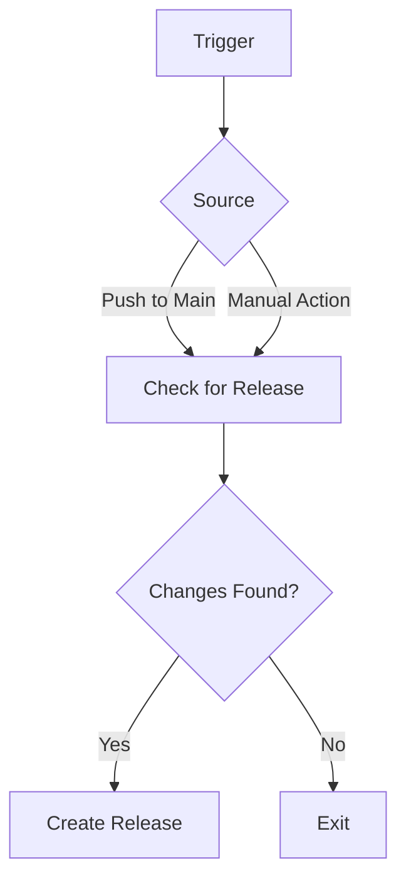
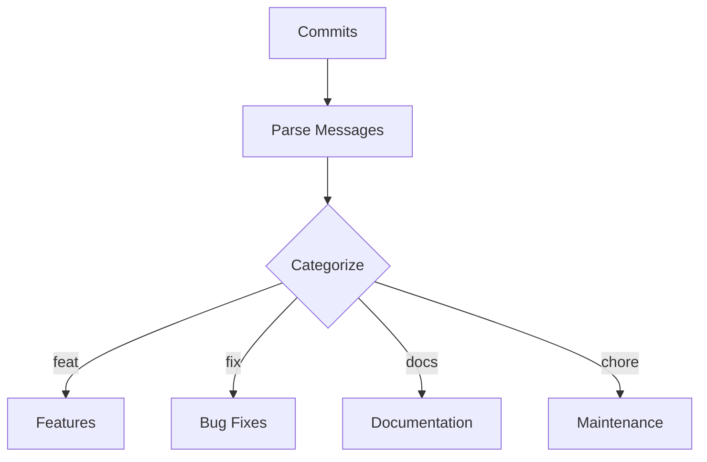
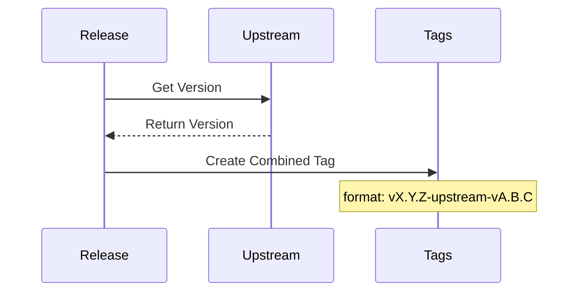

# Release Management Workflow

Managing releases efficiently is crucial for maintaining a structured development lifecycle. This document outlines how the release.yml workflow automates version management and release creation based on conventional commit messages, ensuring a smooth and consistent release process.

## Overview

This workflow is responsible for generating releases by following semantic versioning practices. It leverages GitHub Actions and the release-please tool to determine version bumps, generate changelogs, and publish releases. By automating this process, teams can focus on development while ensuring that releases remain predictable and properly documented.

## How the Release Workflow Works

### Workflow Triggers

The release workflow is automatically triggered under the following conditions:
- **Push to the Main Branch**: When new commits are pushed to main, the workflow checks if a release should be created.
- **Manual Trigger**: The workflow can also be executed manually from the GitHub Actions interface if needed.

### Release Process Flow

Once triggered, the workflow follows these steps:

### 1. Checking Initialization Status

Before proceeding, the workflow verifies whether the repository is correctly initialized. This ensures that release management does not execute prematurely or in an unconfigured state.

### 2. Determining the Release Version

The release-please tool analyzes the commit history and follows semantic versioning rules:
- **Major Version (X.0.0)** → Introduces breaking changes
- **Minor Version (0.X.0)** → Adds new features
- **Patch Version (0.0.X)** → Implements bug fixes or minor updates

A new release is generated only if the commit history includes relevant changes. If no new features or fixes are detected, the workflow exits without creating a new release.

### 3. Changelog Generation

To maintain transparency, the workflow categorizes changes into predefined sections within the changelog:

### 4. Tagging with Upstream Version

When a new release is created, the workflow retrieves the latest upstream version (if applicable) and tags the release accordingly to maintain proper traceability.

### 5. Publishing the Release

Once all steps are completed, the workflow finalizes the release by:
- Updating the repository's tags
- Generating a release entry on GitHub
- Updating the changelog with categorized changes

## Conclusion

The release workflow automates version management, reducing manual effort while ensuring proper versioning and changelog documentation. By following a structured release process, teams can maintain transparency and stability in their software development lifecycle.
