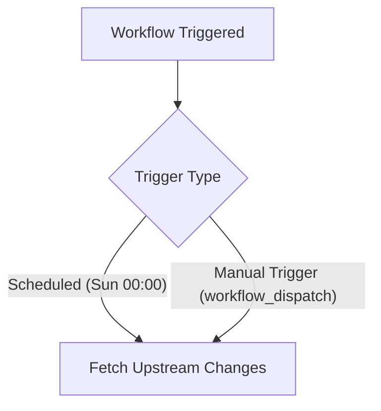
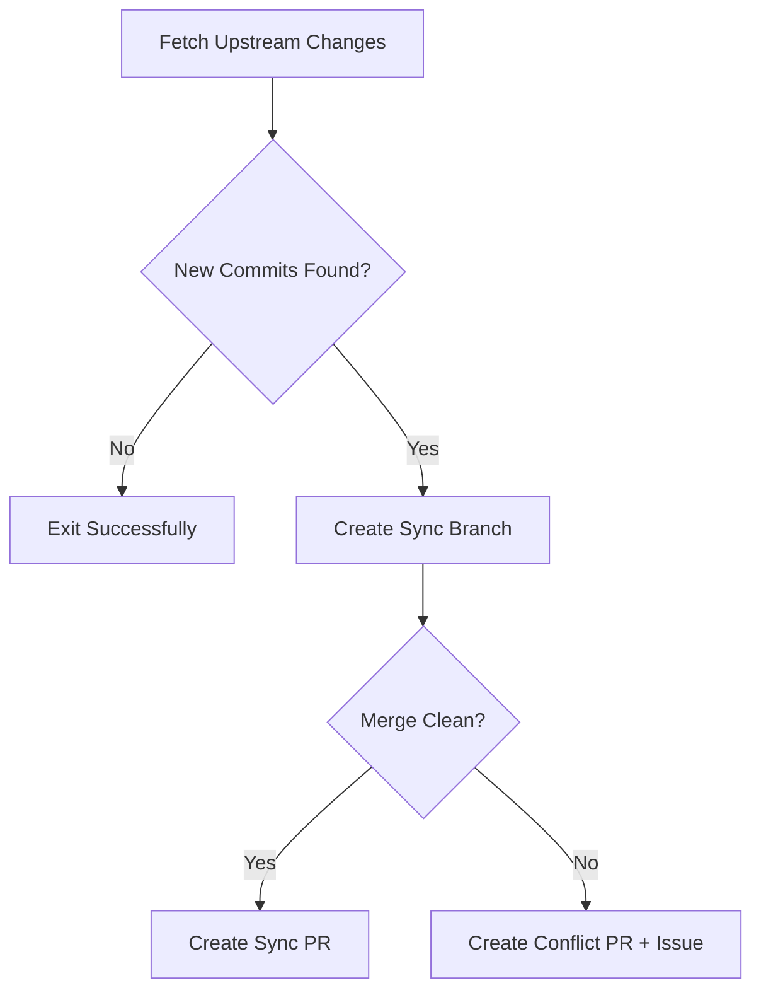
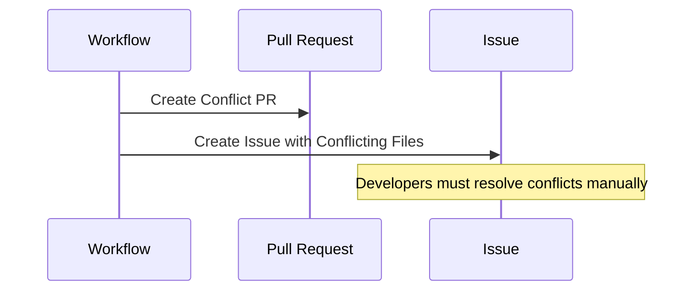

# Upstream Sync Workflow

Keeping a forked repository in sync with its upstream source is a critical aspect of maintaining an effective development workflow. This document outlines the process handled by the sync.yml workflow, ensuring that changes from the original upstream repository are integrated into the fork efficiently and reliably.

## Overview

A fork allows developers to introduce custom modifications while benefiting from upstream updates. However, upstream projects evolve over time, and keeping a fork up to date with the latest changes can become a challenge. This workflow automates that process by periodically checking for new upstream commits, integrating them into the fork, and alerting maintainers when conflicts arise.

## How the Sync Workflow Works

### Sync Trigger Mechanisms

The synchronization process is triggered in two ways:
- **Scheduled Execution**: Runs automatically every Sunday at midnight, ensuring that upstream changes are regularly incorporated.
- **Manual Execution**: Developers can initiate the process manually via the GitHub Actions interface, allowing on-demand updates.

### Overall Sync Process

Once triggered, the workflow follows these steps:

### 1. Checking for Upstream Changes

The workflow begins by connecting to the upstream repository using the stored repository URL. It fetches the latest changes and compares them with the fork's fork_upstream branch. If no new changes are detected, the process exits without further action.

### 2. Creating a Sync Branch

If new commits are found, a new branch (typically named sync/upstream-YYYYMMDD) is created. This branch serves as a staging area where upstream changes are merged before they are reviewed and applied to the fork.

### 3. Merging Upstream Changes

The workflow attempts to merge the new commits into the sync branch. If the merge is clean and no conflicts occur, the process proceeds to the next step. However, if conflicts are detected, additional measures are taken.

### 4. Handling Merge Conflicts

Conflicts arise when upstream changes overlap with local modifications in the fork. If a conflict is detected, the workflow does not proceed with an automatic merge. Instead:

### 5. Creating a Pull Request

If the merge is clean, a pull request is automatically generated against the fork_upstream branch. The PR contains a summary of the upstream changes, allowing maintainers to review, test, and merge the updates before they reach the main development branch.

## Conclusion

Maintaining an up-to-date fork is essential for ensuring compatibility with upstream changes. This workflow automates much of the synchronization process, reducing the burden on developers while ensuring stability and transparency. By regularly integrating upstream updates and managing conflicts proactively, this workflow helps maintain a clean and efficient development environment.
