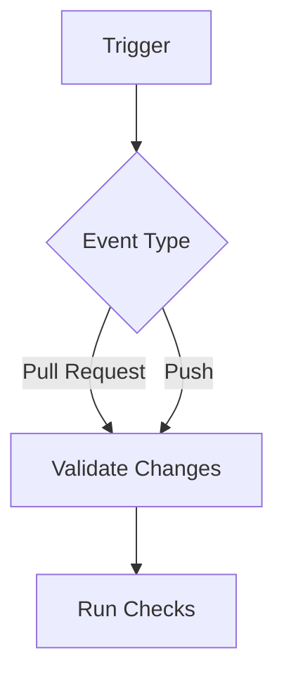
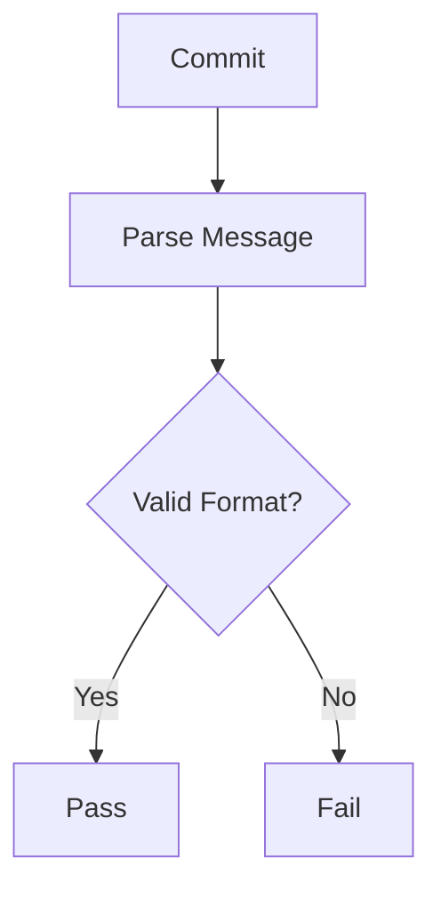
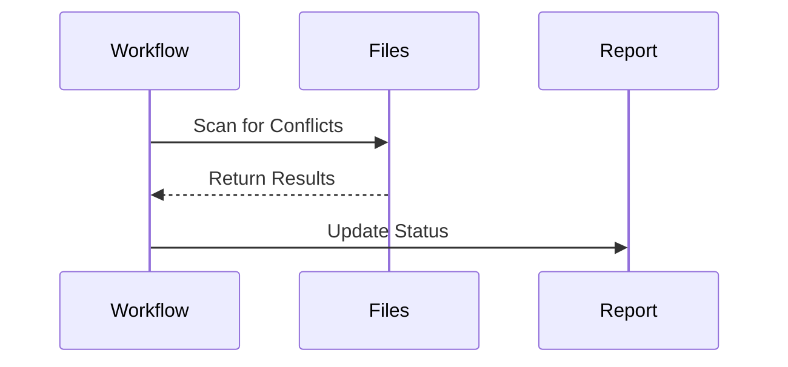
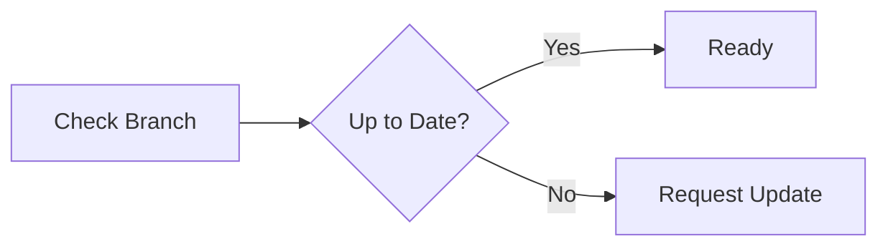

# Validation Workflow

Ensuring code quality and consistency is a crucial part of maintaining a stable and reliable codebase. The validation workflow, defined in .github/workflows/validate.yml, automates this process by enforcing commit standards, detecting conflicts, and verifying branch status before allowing code changes to be merged.

## Overview

The validation workflow runs automatically to check the integrity of pull requests and push events. By validating commit messages, detecting conflicts, and ensuring branches are up-to-date, it helps maintain a clean and structured development process.

## How the Validation Workflow Works

### Workflow Triggers

The workflow is triggered in two scenarios:
- **Pull Requests**: When a pull request is opened or updated targeting main or fork branches, the workflow validates the proposed changes.
- **Push Events**: When a direct push occurs to main or fork branches, validation is performed to ensure compliance.



### Validation Process Flow

Once triggered, the workflow follows a structured sequence to validate changes:

### 1. Checking Commit Messages

Commit messages must follow the conventional commit format to ensure clear versioning and change tracking. The workflow enforces these rules:
- **feat**: Introduces new features
- **fix**: Addresses bugs
- **docs**: Documentation updates
- **chore**: Maintenance tasks
- **upstream**: Syncing upstream changes



### 2. Detecting Merge Conflicts

Merge conflicts can disrupt the development workflow. The workflow scans for conflict markers (`<<<<<<`, `=======`, `>>>>>>`) and blocks merges if any are found.



### 3. Verifying Branch Status

Before merging, the workflow checks if the pull request branch is up-to-date with its base branch. If the branch is outdated, an update request is issued.



### 4. Reporting Validation Status

After validation, a status report is posted on the pull request with detailed results.

Example Status Report:
```
## Validation Status
- ✓ Conventional Commits Passed
- ✓ No Merge Conflicts
- ✓ Branch is Up-to-date

Ready for review!
```

## Conclusion

By automating code validation, this workflow ensures that every pull request follows commit conventions, remains conflict-free, and stays aligned with the latest base branch changes. This process enhances code quality, reduces merge issues, and improves overall development efficiency.
